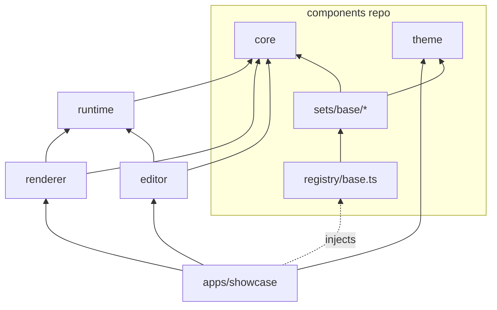
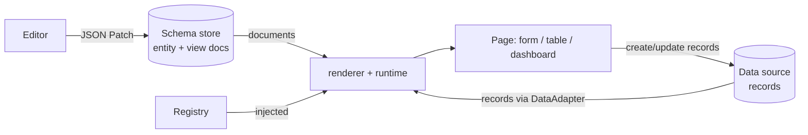

# Architecture

Authoritative architecture for the schema-driven UI engine. If another document disagrees with this one, this one wins. Agents: read this file and `AGENTS.md` before every task.

## 1. What this is

A runtime, schema-driven React engine for "glorified spreadsheet" apps: record tables, user-defined dynamic forms, and rearrangeable tabs and dashboards. Data models and layouts are JSON documents stored in a database. A renderer turns those documents plus live records into working pages, with no redeploy.

Three requirements drive every decision:

- **Portable.** Nothing home-specific or work-specific in the engine. Only the component set, theme and data adapter change between contexts.
- **AI-friendly.** Agents edit small, strictly validated JSON documents, not JSX. The schema is the contract.
- **Owned where it matters.** We own the schema, runtime, renderer, editor logic, styled components and tokens. Hard behavior primitives (accessibility, drag/resize, table virtualization) are accepted dependencies, confined to the components repo and the editor (see §9).

Positioning: Puck is a visual page builder for content. This engine is for data-bound pages. Build-time use (JSON bundled with the app) is the degenerate case of runtime use.

## 2. Two repositories

| Repo | Contains | Depends on | Role |
| --- | --- | --- | --- |
| `engine` | Schema format, runtime, renderer, editor, theme, fixtures, test kit, showcase, examples | React (renderer/editor only), a JSON Schema validator | The open-source project. Gets the README, docs and polish. |
| `components` | Styled field and widget components, registry definitions | `@yadad/core` and `@yadad/testing` pinned to a contract tag; Radix / React Aria / TanStack as accepted deps | Reference component set. Users can bring their own instead. |

The engine never imports from the components repo. Components implement the engine's contract and are handed to the engine through an injected registry. Separate repos make that boundary physical.

## 3. Engine packages

The package list is fixed. Adding a package requires an RFC (`rfcs/NNNN-*.md`).

```
engine/
  packages/
    core/       types, JSON Schemas, document validation, spec migrations,
                contracts (Registry, DataAdapter, Query, theme token names, error format)
    runtime/    headless, no React: form state, condition evaluator,
                record validation, query model, JSON Patch apply, memory adapter
    renderer/   React: walks view documents, resolves registry keys, wires runtime state
    editor/     authoring: emits JSON Patch against entity/view docs; property panels
                generated from registry optionsSchema; drag/resize (editor-only deps)
    theme/      token contract + CSS-variable emitter + 2 variants
  testing/      contract test kit, mock registry, fixture loader (published for the components repo)
  fixtures/     canonical valid/invalid docs, expected error snapshots, migration pairs
  rfcs/         contract and package changes
  apps/showcase/
  examples/     spreadsheet-view, form-builder, dashboard (each = documents + theme choice)
  ARCHITECTURE.md  AGENTS.md  (+ AGENTS.md per package)
```

| Package | Owns | Must not know about |
| --- | --- | --- |
| core | Document shapes, validation, migrations, interfaces | React, components, themes, I/O |
| runtime | State and logic: forms, conditions, record validation, queries, patches | React, DOM, components |
| renderer | Turning documents + runtime state into React trees via registry keys | Specific components, the editor, drag libraries |
| editor | Producing JSON Patch operations against documents | Specific components (asks the registry) |
| theme | Token names and values, CSS variables | Everything else |

Why `runtime` is separate: TanStack Table, Formily, JSON Forms, RJSF (`@rjsf/utils`), react-grid-layout v2 (`src/core`) and React Stately all keep state and logic out of the view layer. It keeps `core` small and slow-moving, makes logic testable without a DOM, and lets the same record validation run server-side (FastAPI can validate against the same generated JSON Schema).

## 4. Dependency rules



Arrows mean "imports from".

- `core` imports nothing except its validator library.
- `runtime` imports `core` only. No `react`.
- `renderer` and `editor` import `core` and `runtime` only. They never import a component; they look up registry keys.
- `theme` imports nothing.
- Nothing in `packages/` imports the components repo.
- No deep imports (`@yadad/core/src/...`); public entry points only.
- The host app (showcase, an intake-form app, a home app) builds a `Registry` and a `DataAdapter` and passes them in via props or React context. This is the only place dependency injection is used.

CI enforces these with dependency-cruiser. A forbidden import fails the build.

## 5. Runtime model: two inputs, two writers



- **Two separate streams.** Documents describe shape. Records are content. They are joined by field `id`; neither contains the other.
- **Two separate writers.** The editor (and agents) write documents. Pages write records. No code path writes both.
- **Data access is injected.** Views name a `dataSource` key; the host maps keys to adapters, just as it maps field types to components. No API URLs in documents.
- **Build-time** = pass a bundled document where a fetched one would go. Nothing else changes.

## 6. Document model: entities and views

An **entity** owns fields, types and validation. A **view** owns layout and references field ids. One entity can have many views.

```jsonc
// Entity: data model
{ "kind": "entity", "specVersion": 1, "id": "workout_set", "revision": 7,
  "fields": [
    { "id": "exercise", "type": "select", "label": "Exercise", "required": true,
      "options": { "source": "static", "values": ["Squat", "Bench"] } },
    { "id": "weight", "type": "number", "label": "Weight", "min": 0, "unit": "kg" } ] }

// Form view: layout only
{ "kind": "form", "specVersion": 1, "id": "log_set", "entity": "workout_set", "revision": 3,
  "dataSource": "default",
  "sections": [ { "id": "main", "title": "Set", "items": [
    { "field": "exercise" },
    { "field": "weight",
      "visibleWhen": { "op": "notEmpty", "field": "exercise" } } ] } ] }
```

View kinds in v0: `form` (sections, items), `table` (columns, default sort/filter, inline-edit flags), `dashboard` (tabs, grid items `{x, y, w, h, widget}`, widget union). All three shapes are designed and frozen in Phase 1, even though tables and dashboards render later.

Rules:

- **Discriminated unions everywhere:** `kind` on documents, `type` on fields, `op` on conditions, `widget` on dashboard items. Each field type has its own typed `options` object.
- **No escape hatches in v0:** no index signatures, no `additionalProperties: true`, no free-form props bag, no `custom` field type taking arbitrary JSON, no string expressions.
- **Conditions are a JSON AST**, not strings. Ops: `eq, neq, in, gt, gte, lt, lte, empty, notEmpty, and, or, not`. Types and JSON Schema in `core`; evaluation in `runtime`. Used for `visibleWhen`, `enabledWhen`, `requiredWhen`.
- **Hidden fields keep their values by default.** Opt in per item with `clearWhenHidden: true` (Form.io's `clearOnHide`).
- **One source of truth** for TypeScript types and JSON Schema: author once (Zod- or TypeBox-style), generate the other, commit generated `*.schema.json` so Python and agents can read them. Tool choice is a Phase 1 decision. Never hand-edit both.

## 7. Validation: two kinds, one owner each

| | Document validation | Record validation |
| --- | --- | --- |
| Question | Is this entity/view well-formed? | Is this record valid for its entity? |
| Lives in | `core` | `runtime` |
| How | Meta JSON Schema + referential checks (view fields exist, condition fields exist, entity exists) | Entity compiled to standard JSON Schema, then validated |
| Constraints | n/a | `required`, `min`, `max`, `pattern` live on the entity. Views may only make rules stricter, never looser. |

Error format everywhere: `{ path, code, message, hint }`, where `path` is a JSON Pointer. Messages must be readable by a person and actionable by an agent.

## 8. Versioning: two different versions

| | `specVersion` (engine format) | `revision` (user document) |
| --- | --- | --- |
| Changes when | The engine's document language changes (an engine PR) | Someone edits an entity or view |
| Migration | Pure `migrate(doc, from, to)` in `core`, plus a before/after fixture pair | None for additive edits. Destructive edits (delete a field, change its type) go through an explicit editor transform. |
| Records | n/a | Store `{ entityId, entityRevision }`. Old records are upcast lazily on read. If one fails validation, show "saved under revision N" instead of crashing. |

## 9. Registry contract and ownership

Exact-key lookup, no ranked testers.

```ts
interface FieldTypeEntry<T> {
  type: string;                        // "number"
  optionsSchema: JSONSchema;           // drives editor property panels and agent docs
  Input: Component<InputProps<T>>;     // form control
  Display: Component<DisplayProps<T>>; // table cell / read-only
  CellEditor?: Component<InputProps<T>>; // inline edit; falls back to Input
}

interface Registry {
  fields: Record<string, FieldTypeEntry<any>>;
  layout: { Section; Tabs; GridItem; FieldFrame }; // FieldFrame = label, help, error chrome
  widgets: Record<string, WidgetEntry>;
}
```

`describeRegistry()` emits a markdown/JSON catalog of field types, options and widgets. Use it in `AGENTS.md` and agent prompts so agents only use what exists.

What we own vs depend on:

| Layer | Decision | Where |
| --- | --- | --- |
| Schema, runtime, renderer, editor logic, tokens | Own | engine |
| Styled components (shadcn "open code" model) | Own, versioned `v1/v2` side by side, `UPSTREAM.md` per component | components repo |
| Accessible behavior primitives (Radix, React Aria or Base UI) | Accept as dependency | components repo only |
| Table state and virtualization (TanStack Table / Virtual) | Accept as dependency; sort/filter semantics stay in documents + adapter | components repo only |
| Dashboard drag/resize (react-grid-layout v2) | Accept as dependency, behind `editor/dnd` adapter | editor only |
| List/section reordering (`@dnd-kit/react`, pre-1.0) | Accept as dependency, behind `editor/dnd` adapter | editor only |
| Dashboard rendering in view mode | Own: plain CSS grid from `x, y, w, h` | renderer |

## 10. Data adapter

```ts
interface DataAdapter {
  find(entity: string, query: Query): Promise<Page<Record>>;
  findOne(entity: string, id: string): Promise<Record | null>;
  create(entity: string, record: Record, meta: { entityRevision: number }): Promise<Record>;
  update(entity: string, id: string, patch: Partial<Record>, meta: { entityRevision: number }): Promise<Record>;
  delete(entity: string, id: string): Promise<void>;
}
// Query = { filter?: ConditionAST, sort?: {field, dir}[], page?: {offset, limit} }
```

Interface and `Query` in `core`. Memory adapter in `runtime`. Supabase adapter in `adapters/supabase` (depends on `core` only), or in the host app.

## 11. Stability policy

- Fixed package list; new packages and new dependencies need an RFC.
- Stay on `0.x` while there is one user, but tag `contract-vN` on `core`. Changes to `core` exports or schema files need an RFC, a `specVersion` bump, a migration and human review.
- Changesets on every PR. Deprecations last at least one minor with a runtime warning. Breaking changes ship with a compatibility path.
- Public API reports (API Extractor or similar) checked in, so export surfaces cannot widen silently.
- Size budgets per package (size-limit).
- `core` reaches 1.0 when two real apps (a home app and the intake form) have run on an unchanged contract for several weeks.

## 12. Testing

1. **Fixture corpus** (`fixtures/`): valid and invalid documents for every field type and view kind, each invalid one with an expected-error snapshot. This is also the spec.
2. **Contract test kit** (`testing/`): the components repo runs it against every registry entry. Checks: renders with fixture options, emits the right JSON type on change, shows a given error, passes axe.
3. **Renderer tests against a mock registry** (stub components with `data-testid`). Engine CI never needs real components.
4. **Migration tests:** every historical fixture migrates to the current `specVersion` and validates.
5. **Runtime unit and property tests** for the condition evaluator and form state.
6. **Cross-language check:** a small pytest job validates the record fixtures against the generated JSON Schemas.
7. **Visual tests** (Playwright screenshots) in the components repo only, from Phase 4.
