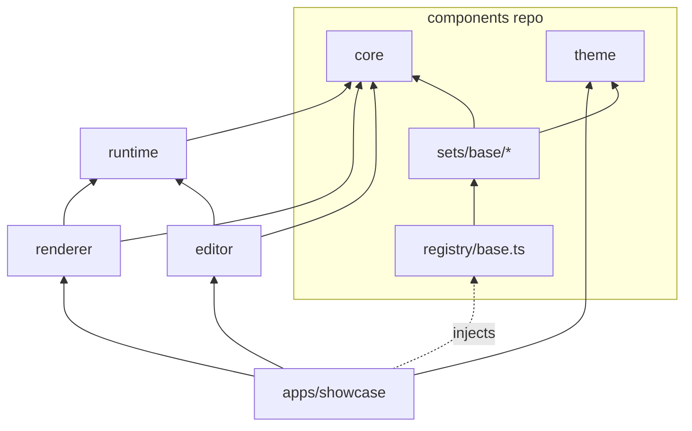
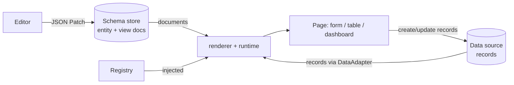

# Architecture

Authoritative architecture for the schema-driven UI engine. If another document disagrees with this one, this one wins. Agents: read this file and `AGENTS.md` before every task.

## 1. What this is

A runtime, schema-driven React engine for "glorified spreadsheet" apps: record tables, user-defined dynamic forms, and rearrangeable tabs and dashboards. Data models and layouts are JSON documents stored in a database. A renderer turns those documents plus live records into working pages, with no redeploy.

Three requirements drive every decision:

- **Portable.** Nothing home-specific or work-specific in the engine. Only the component set, theme and data adapter change between contexts.
- **AI-friendly.** Agents edit small, strictly validated JSON documents, not JSX. The schema is the contract.
- **Owned where it matters.** We own the schema, runtime, renderer, editor logic, styled components and tokens. The editor's drag and resize is hand-written and keyboard accessible; table virtualization and accessible-widget libraries are accepted dependencies, confined to the components repo (see §9).

Positioning: Puck is a visual page builder for content. This engine is for data-bound pages. Build-time use (JSON bundled with the app) is the degenerate case of runtime use.

## 2. Two repositories

| Repo | Contains | Depends on | Role |
| --- | --- | --- | --- |
| `yadad` (this repo) | Schema format, runtime, renderer, editor, theme, fixtures, test kit, showcase | React (renderer/editor only) | The open-source project. Gets the README, docs and polish. |
| `yadad-components` | Styled field and widget components, registry definitions | `@yadad/core` as a peer dependency (a published version range); `@yadad/testing` as a dev dependency | Reference component set. Users can bring their own instead. |

The engine never imports from the components repo. Components implement the engine's contract and are handed to the engine through an injected registry. Separate repos make that boundary physical. The components repo is mirrored on the same GitLab instance and publishes to the same npm registry (D17).

## 3. Engine packages

The package list is fixed. Adding a package requires an RFC (`rfcs/NNNN-*.md`).

```
yadad/
  packages/
    core/       types, JSON Schemas, document validation, spec migrations,
                contracts (Registry, DataAdapter, Query, error format)
    runtime/    headless, no React: form state, condition evaluator,
                record validation, query model, JSON Patch apply,
                memory / key-value / HTTP adapters
    renderer/   React: walks view documents, resolves registry keys, wires runtime state
    editor/     authoring: emits JSON Patch against entity/view docs; property panels
                from an exhaustive per-field-type map; hand-written drag/resize
    theme/      token names + token values + CSS-variable emitter
  testing/      contract test kit, mock registry (published)
  fixtures/     canonical valid/invalid docs and expected-error lists
  rfcs/         contract and package changes (reserved)
  apps/showcase/
  examples/     (reserved, empty)
  ARCHITECTURE.md  AGENTS.md  (+ AGENTS.md per package)
```

| Package | Owns | Must not know about |
| --- | --- | --- |
| core | Document shapes, validation, migrations, interfaces | React, components, themes, I/O |
| runtime | State and logic: forms, conditions, record validation, queries, patches, the data adapters | React, DOM, components |
| renderer | Turning documents + runtime state into React trees via registry keys | Specific components, the editor, drag/resize |
| editor | Producing JSON Patch operations against documents | Specific components (asks the registry) |
| theme | Token names and values, CSS variables | Everything else |

Why `runtime` is separate: TanStack Table, Formily, JSON Forms, RJSF (`@rjsf/utils`) and React Stately all keep state and logic out of the view layer. It keeps `core` small and slow-moving, makes logic testable without a DOM, and lets the same record validation run server-side (a backend can validate against the same generated JSON Schema).

## 4. Dependency rules



Arrows mean "imports from".

- `core` imports nothing.
- `runtime` imports `core` only. No `react`.
- `renderer` and `editor` import `core` and `runtime` only. They never import a component; they look up registry keys.
- `theme` imports nothing.
- Nothing in `packages/` or `testing/` imports the components repo.
- No deep imports (`@yadad/core/src/...`); public entry points only.
- Test files in any package may also import `@yadad/testing` (the mock registry); production files may not (D20).
- The host app (the showcase, or any host app) builds a `Registry` and a `DataAdapter` and passes them in via props or React context. This is the only place dependency injection is used.

CI enforces these with dependency-cruiser. A forbidden import fails the build.

## 5. Runtime model: two inputs, two writers



- **Two separate streams.** Documents describe shape. Records are content. They are joined by field `id`; neither contains the other.
- **Two separate writers.** The editor (and agents) write documents. Pages write records. No code path writes both.
- **Data access is injected.** Views name a `dataSource` key; the host maps keys to adapters, just as it maps field types to components. No API URLs in documents.
- **Build-time** = pass a bundled document where a fetched one would go. Nothing else changes.

## 6. Document model: entities and views

An **entity** owns fields, types and validation. A **view** owns layout and references field ids. One entity can have many views.

```jsonc
// Entity: data model
{ "kind": "entity", "specVersion": 0, "id": "workout_set", "revision": 7,
  "fields": [
    { "id": "exercise", "type": "select", "label": "Exercise", "required": true,
      "options": { "source": "static", "values": ["Squat", "Bench"] } },
    { "id": "weight", "type": "number", "label": "Weight", "min": 0, "unit": "kg" } ] }

// Form view: layout only
{ "kind": "form", "specVersion": 0, "id": "log_set", "entity": "workout_set", "revision": 3,
  "dataSource": "default",
  "sections": [ { "id": "main", "title": "Set", "items": [
    { "field": "exercise" },
    { "field": "weight",
      "visibleWhen": { "op": "notEmpty", "field": "exercise" } } ] } ] }
```

View kinds: `form` (sections, items), `table` (columns, initial sort, `pageSize`, a fixed `filter`, viewer `quickFilters`, inline-edit flags), `dashboard` (tabs, grid items `{x, y, w, h, widget}`, widget union: `view` and `count`). All three shapes are designed and implemented at `specVersion: 0`, and the contract is still in flux (§11).

Rules:

- **Discriminated unions everywhere:** `kind` on documents, `type` on fields, `op` on conditions, `widget` on dashboard items. Each field type has its own typed `options` object (`select` has `options: { source: "static", values: string[] }` today; dynamic sources come later).
- **No escape hatches:** no index signatures, no `additionalProperties: true`, no free-form props bag, no `custom` field type taking arbitrary JSON, no string expressions.
- **Conditions are a JSON AST**, not strings. Ops: `eq, neq, gt, gte, lt, lte, in, contains, empty, notEmpty, and, or, not`. Types and validation in `core`; evaluation in `runtime`. Used for `visibleWhen` and `requiredWhen` on form items.
- **Hidden fields keep their values by default.** Opt in per item with `clearWhenHidden: true` (Form.io's `clearOnHide`).
- **One source of truth:** the TypeScript types in `core` are the source of truth, and document validation is written against them by hand (`validateDocument`, `validateDocuments`). Generated standard JSON Schemas for each document shape — so backends and agents can read the contract — are the next step; nothing is hand-maintained in parallel.

## 7. Validation: two kinds, one owner each

| | Document validation | Record validation |
| --- | --- | --- |
| Question | Is this entity/view well-formed? | Is this record valid for its entity? |
| Lives in | `core` | `runtime` |
| How | Shape per document, written in `core` against the TS types. Across a set, `validateDocuments`: referential checks (the view's entity exists, field ids exist on that entity, widgets point at existing views) | Hand-written per field type in `runtime` for now; the entity will compile to standard JSON Schema instead, so a backend can validate against the same schema |
| Constraints | n/a | `required`, `min`, `max` (and `step` for numbers) live on the entity. Views may only make rules stricter, never looser. |

Error format everywhere: `{ path, code, message, hint }`, where `path` is a JSON Pointer. Messages must be readable by a person and actionable by an agent. A set's errors also name the document they belong to (`DocumentError.document`) and, where a value must be one of a known set, the accepted alternatives (`DocumentError.allowed`).

Validation also returns `warnings` in the same shape (code `empty`): the document is valid, but probably not what the author meant, such as a form with no fields or a tab with no widgets. Warnings never block a document, so editors can pass through those states.

Referential checks span documents, so they run only when a set of documents is validated together (`validateDocuments`); a single document is checked for shape alone.

## 8. Versioning: two different versions

| | `specVersion` (engine format) | `revision` (user document) |
| --- | --- | --- |
| Changes when | The engine's document language changes (an engine change) | Someone edits an entity or view |
| Migration | Pure `migrate(doc, from, to)` in `core`, plus a before/after fixture pair | None for additive edits. Destructive edits (delete a field, change its type) go through an explicit editor transform. |
| Records | n/a | Store `{ entityId, entityRevision }`. Old records are upcast lazily on read. If one fails validation, show "saved under revision N" instead of crashing. |

Pre-contract documents use `specVersion: 0`; the validator rejects any other value for now (no freeze is planned — §11). Each document's `revision` counts its own edits: bump it whenever you change that document. A view's revision is independent of its entity's, even when the numbers happen to match.

## 9. Registry contract and ownership

Exact-key lookup, no ranked testers.

```ts
interface FieldTypeEntry<K extends FieldType, N> {
  type: K;                        // "number"
  Input: Component<InputProps<FieldDefinitions[K], FieldValueTypes[K]>, N>;     // form control
  Display: Component<DisplayProps<FieldDefinitions[K], FieldValueTypes[K]>, N>; // table cell / read-only
}

interface Registry<N> {
  fields: { readonly [K in FieldType]: FieldTypeEntry<K, N> }; // mapped type, no index signature
  layout: { FieldFrame; Section; Button; Table; ErrorSummary; Tabs; Panel };
  widgets: { count: Component<CountWidgetProps, N> };         // "view" widgets render through the renderer itself
}
```

Table inline editing reuses `Input` (there is no separate `CellEditor`), and the editor's property panels come from an exhaustive per-field-type map in the `editor` package rendered with the registry's own inputs (there is no `optionsSchema` yet). A `describeRegistry()` catalog of the field types, options and widgets a document can use is the planned agent-facing surface (AGENTS.md).

What we own vs depend on:

| Layer | Decision | Where |
| --- | --- | --- |
| Schema, runtime, renderer, editor logic, tokens | Own | engine |
| Styled components | Own; one `vN` folder per version side by side, `UPSTREAM.md` per component (the base set is written from scratch) | components repo |
| Accessible behavior primitives (Radix, React Aria or Base UI) | Accept as dependency when needed; the current base set is hand-written | components repo only |
| Table state and virtualization (TanStack Table / Virtual) | Accept as dependency when needed; not used yet — the base table renders all rows — and sort/filter semantics stay in documents + adapter | components repo only |
| Dashboard drag/resize | Own: hand-written over CSS grid — pointer drag and corner resize, arrow keys, each change announced | editor only |
| Field/section/column reordering | Own: hand-written buttons in the view editors | editor only |
| Dashboard rendering in view mode | Own: plain CSS grid from `x, y, w, h` with a fixed row height (`--yadad-grid-row-height`, 4rem default; D18) | renderer |

## 10. Data adapter

```ts
interface DataAdapter {
  find(entity: string, query: Query): Promise<Page<DataRecord>>;
  findOne(entity: string, id: string): Promise<DataRecord | null>;
  create(entity: string, values: RecordValues, meta: WriteMeta): Promise<DataRecord>;
  update(entity: string, id: string, patch: RecordValues, meta: WriteMeta): Promise<DataRecord>;
  delete(entity: string, id: string, meta?: WriteMeta): Promise<void>;
  batch(entity: string, ops: BatchOperations, meta: WriteMeta): Promise<BatchResult>;
}
// WriteMeta = { entityRevision: number; baseVersion?: string }
// Records carry an opaque `version`; writes send it back as `baseVersion`, and a stale one is a conflict.
// Query = { filter?: Condition, sort?: {field, dir}[], page?: {offset, limit} }
```

Interface, `Query` and the typed adapter errors in `core`. The memory, key-value and HTTP adapters in `runtime` all implement record versions and optimistic concurrency; the HTTP adapter (`createHttpAdapter`) speaks the records protocol in `docs/records-protocol.md` to a same-origin backend. A Supabase adapter can live here (depending on `core` only) or in the host app; none exists yet.

## 11. Stability policy

- Fixed package list; new packages and new dependencies need an RFC.
- The contract is in flux: `specVersion` stays `0`, and no `contract-vN` freeze or tag is planned (D13). When the format does change, it ships with a `specVersion` bump, a `migrate()` step and a before/after fixture pair (AGENTS.md rule 8) — a future freeze is a separate decision, not a deadline.
- Agents land and release their own work (D14): changes to a published package carry a changeset; breaking changes carry a `BREAKING CHANGE:` note that says exactly what consumers must change. Consumers adopt the new version, and the components repo widens its peer range when a release falls outside it.
- Deprecations last at least one minor with a runtime warning.
- Public API reports and size budgets (size-limit) are the next CI gates (see `.github/workflows/ci.yml`).
- `core` reaches 1.0 when two real apps (the exit-criteria apps, D12) have run on an unchanged contract for several weeks.

## 12. Testing

1. **Fixture corpus** (`fixtures/`): valid documents for the field types and view kinds in use, and invalid documents — each with the exact expected errors asserted in `testing/`. This is also the spec.
2. **Contract test kit** (`testing/`): the components repo runs it against every registry entry. Checks: renders with fixture options, emits the right JSON type on change, shows a given error, passes axe.
3. **Renderer tests against a mock registry** (stub components with `data-testid`). Engine CI never needs real components.
4. **Migration tests:** once a `specVersion` bump ships a migration, every historical fixture migrates to the current `specVersion` and validates.
5. **Runtime unit tests** for the condition evaluator and form state.
6. **Cross-language check:** a small pytest job validates the record fixtures against the generated JSON Schemas — planned, once the schemas exist.
7. **Visual checks:** the components repo has a vite gallery for manual browser checks; automated Playwright screenshot tests are the plan.
