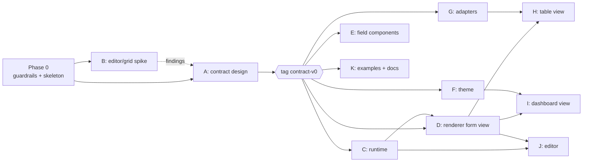

# Build Plan

How to sequence the work, what each phase must prove, and where agents can run in parallel. Exit criteria are real apps (an intake form, a to-do app, a Fitnotes clone), not feature checklists.

## Phases

| Phase | Scope | Exit criteria |
| --- | --- | --- |
| **0. Guardrails + walking skeleton** (~1 week) | pnpm monorepo, TS project refs, Vitest, dependency-cruiser, changesets, root + per-package `AGENTS.md`, `fixtures/`. One `text` field end to end: entity + form view → `core` validates → `runtime` state → `renderer` → injected mock registry → memory adapter `create()`. Components repo created with `text/v1`. | CI fails on a deliberately forbidden import (proven by a test). Showcase renders and saves one text field. `text/v1` passes the contract kit. |
| **1. Contract design + freeze** (critical) | Entity; field types `text, number, date, select, boolean`; **all three view shapes** (form, table, dashboard); condition AST; `Registry`; `DataAdapter` + `Query`; theme token names; `specVersion` + `migrate()` harness; error format; generated JSON Schemas; `describeRegistry()`. | Fixture corpus green; every error has a JSON Pointer path and a readable message; RFC-0001 "contract v0" merged; **`contract-v0` tagged**. The intake form and the Fitnotes entities can be *expressed* in documents (rendering not required). |
| **1b. Editor/grid spike** (parallel with 1, throwaway) | react-grid-layout v2 + `@dnd-kit/react` editing a dashboard view via JSON Patch. | Dashboard item shape round-trips through drag/resize. Findings feed RFC-0001. Spike code deleted. |
| **2. Forms** | Runtime form state, conditions, record validation; renderer form view; intake form port. | Intake form renders from a DB-stored document; conditional visibility and required fields work; records save with `entityRevision`. |
| **3. Records / table view** | Table view from the same entity; sort/filter via `Query`; inline edit via `CellEditor`; virtualization in the components repo. | To-do app fully usable (list, filter, inline edit, create via form). 10k-row memory dataset scrolls smoothly. |
| **4. Dashboard (view mode)** | Tabs + CSS-grid dashboard; widgets: record list, count, chart stub. | Fitnotes clone: tabs for log / history / stats, dashboard rendered from documents. |
| **5. Editor** | Property panels from `optionsSchema`; add/remove fields with destructive-edit transforms; dashboard drag/resize; undo via the patch log. | Fitnotes layout rearranged in the UI, saved as a new revision; old records still render. |
| **6. Hardening + docs** | Supabase adapter, second theme variant, showcase, README (naming prior art), visual tests, API reports. | Two apps run on an unchanged contract for several weeks → `core` 1.0. |

**Critical path:** 0 → 1 (freeze) → runtime form state → renderer form view (2) → table (3) → dashboard (4) → editor (5). Components, theme, adapters and docs stay off the critical path once `contract-v0` is tagged.

## Frozen before parallel work starts

- `core` types and JSON Schemas: entity, all view kinds, conditions
- `Registry` / `FieldTypeEntry` interfaces and prop types
- `DataAdapter` and `Query`
- Theme token names
- Error format
- Fixture corpus layout

## Parallelization map

| ID | Workstream | Where | Starts after | Depends on | Agent fit |
| --- | --- | --- | --- | --- | --- |
| A | Contract | `core`, `fixtures/` | Phase 0 | — | **Human-led**; agent may draft fixtures |
| B | Editor/grid spike | scratch branch | Phase 0 | draft contract | Yes (throwaway) |
| C | Runtime: conditions, record validation, form state | `runtime` | `contract-v0` | A | Excellent (pure functions + fixtures) |
| D | Renderer form view | `renderer` | `contract-v0` | A; C via interface stubs | Yes |
| E | Field components ×5 | components repo | `contract-v0` | A, test kit | Best fit; one agent per component |
| F | Theme tokens + 2 variants | `theme` | `contract-v0` | A (token names) | Yes |
| G | Adapters: memory → Supabase | `runtime`, `adapters/supabase` | `contract-v0` | A | Yes |
| H | Table view + table component | `renderer` + components | D stable | A, C, G | Yes, after D |
| I | Dashboard view + widgets | `renderer` + components | D stable | A, F | Yes, after D |
| J | Editor | `editor` | C, D done; B findings | A, C | Partly; drag code needs close human review |
| K | Examples, showcase, docs | `examples/`, `apps/` | `contract-v0` | A | Yes, continuous |

After `contract-v0`: C, D, E, F, G and K run together. H and I start once D's view-walking is stable. J starts once C and D are done. Run **2–4 agents at a time**; review capacity, not agent count, is the limit.

## Coordination rules for parallel agents

1. **Worktree per task**, branched from `main`: `git worktree add .worktrees/<task> -b agent/<task> main`. Worktrees stay inside the repo under the gitignored `.worktrees/`, never next to it. Remove after merge. No shared stash.
2. **Isolated state:** memory adapter and a random port per worktree. No shared Supabase or dev server.
3. **One package per PR** plus a changeset. CI rejects multi-package PRs without the maintainer-only `cross-package` label.
4. **CODEOWNERS:** `packages/core`, `fixtures/` and `rfcs/` require the maintainer's review. Agents that need a contract change open an issue or draft RFC and stop.
5. **Task cards** (`docs/TASKS.md` or issues): package, allowed files, fixtures that must pass, "done when".
6. **Cross-repo pinning:** the components repo depends on `@yadad/core` and `@yadad/testing` at a `contract-vN` prerelease, not a workspace link. A contract bump arrives as one PR in the components repo that runs the contract kit.
7. **Merge one PR at a time** and run the full suite after each. A clean merge can still hide a semantic conflict (for example, a renamed field).

## CI gates

Engine: typecheck → dependency-cruiser → unit tests + fixture validation → migration tests → size-limit → API report diff → changeset present.
Components: typecheck → contract kit → axe → (Phase 4+) visual tests.

## Risks

| Risk | Severity | Mitigation |
| --- | --- | --- |
| Contract churn after agents fan out (the Object UI failure mode) | High | All view kinds designed in Phase 1, spike before freeze, RFC + CODEOWNERS on `core` |
| Drag/resize dashboard editor | High | react-grid-layout v2 behind `editor/dnd`; `@dnd-kit/react` is pre-1.0, so keep it swappable; renderer uses neither |
| Accessible primitives (combobox, date picker, focus) | High if built by hand | Radix / React Aria in the components repo; own only styling |
| Inline editing + virtualization (focus loss, keyboard across virtual rows) | Medium-high | TanStack Table + Virtual; single "active cell" model in runtime; budget real time in Phase 3 |
| Schema/record migrations on field type changes | Medium | `specVersion` vs `revision`; lazy upcast on read; destructive edits only via explicit transforms; never coerce silently |
| JS/Python validation drift | Medium | Records validated with generated standard JSON Schema; same fixtures in a pytest job |
| Review overload from agents | Medium | 2–4 agents, fixture-driven tasks, one package per PR |
